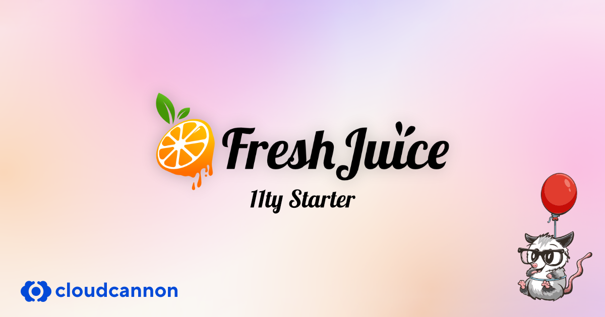

# FreshJuice 11ty Starter a.k.a. Snappy Lemon



> **Work in Progress** - This starter is under active development. Feel free to use it as-is, but expect breaking changes until v1.0 release.

**[Live Demo](https://snappy-lemon-starter.freshjuice.dev)**

A modern, fast, and accessible starter theme for building static websites with [Eleventy](https://www.11ty.dev/), [TailwindCSS](https://tailwindcss.com/), and [CloudCannon CMS](https://cloudcannon.com/).

## Features

- **Eleventy v3** - Fast static site generation with ES modules
- **TailwindCSS v4** - Utility-first CSS framework
- **Alpine.js** - Lightweight JavaScript for interactivity
- **Pagefind** - Static search with zero configuration
- **Shiki** - Beautiful syntax highlighting for code blocks
- **eleventy-img** - Automatic image optimization (AVIF, WebP, JPEG)
- **Phosphor Icons** - 6,000+ icons with multiple weights
- **CloudCannon CMS** - Visual editing and page builder blocks
- **Speculation Rules** - Instant page loads with prefetching
- **Accessibility** - WCAG 2.1 AA compliant with automated testing
- **SEO Ready** - Sitemap, RSS feed, meta tags, Open Graph
- **LLM Ready** - llms.txt and llms-full.txt for AI assistants

## Quick Start

### Prerequisites

- Node.js 24 or higher (see `.nvmrc`)
- npm

### Installation

```bash
# Clone the repository
git clone https://github.com/AbolDev/freshjuice-11ty-starter.git
cd freshjuice-11ty-starter

# Install dependencies
npm install

# Start development server
npm run dev
```

Open http://localhost:8080 to view your site.

### Available Scripts

| Command | Description |
|---------|-------------|
| `npm run dev` | Start development server with hot reload |
| `npm run build` | Build for production |
| `npm run clean` | Remove `_site` and `.cache` folders |
| `npm run lint` | Run ESLint (run `setup:local` first) |
| `npm run format` | Format code with Prettier (run `setup:local` first) |
| `npm run test` | Run accessibility tests (run `setup:local` first) |
| `npm run favicon` | Generate favicons from logo (run `setup:local` first) |

## Local Development Tools

Some features (linting, testing, favicon generation) require additional packages. Install them once for local development:

```bash
npm run setup:local
```

This installs:

| Package | Purpose | Script |
|---------|---------|--------|
| `eslint` | JavaScript linting | `npm run lint` |
| `prettier` | Code formatting | `npm run format` |
| `favicons` | Generate all favicon sizes | `npm run favicon` |
| `puppeteer` | Browser automation for tests | `npm run test` |
| `@axe-core/puppeteer` | Accessibility testing engine | `npm run test` |
| `serve-handler` | Local server for tests | `npm run test` |
| `rimraf` | Cross-platform rm -rf | `npm run clean` |

> **Note:** These packages are not installed on build servers (Netlify, Vercel, Cloudflare) to keep builds fast.

## Project Structure

```
freshjuice-11ty-starter/
├── src/
│   ├── _data/                 # Global data files
│   │   ├── build.js           # Build info (git hash, timestamp)
│   │   ├── meta.yaml          # Site metadata
│   │   ├── navigation.yaml    # Navigation menus
│   │   └── footer.yaml        # Footer configuration
│   ├── _includes/
│   │   ├── layouts/           # Page layouts
│   │   │   ├── base.njk       # Base HTML layout
│   │   │   ├── post.njk       # Blog post layout
│   │   │   ├── author.njk     # Author page layout
│   │   │   ├── legal.njk      # Legal pages (privacy, terms)
│   │   │   ├── landing.njk    # Landing page with blocks
│   │   │   └── error.njk      # Error pages (404, 500)
│   │   ├── partials/          # Reusable partials
│   │   │   ├── header.njk
│   │   │   ├── footer.njk
│   │   │   └── metatags.njk
│   │   ├── _components/       # Nunjucks component macros
│   │   │   └── index.njk
│   │   └── _blocks/           # CloudCannon page blocks
│   │       ├── hero.njk
│   │       ├── features.njk
│   │       ├── cta.njk
│   │       ├── testimonials.njk
│   │       ├── content.njk
│   │       └── _schemas/      # Block schemas for CMS
│   ├── assets/
│   │   ├── css/
│   │   │   ├── main.css       # Entry point
│   │   │   ├── _base.css      # CSS variables, reset
│   │   │   ├── _typography.css # Prose styles
│   │   │   ├── _buttons.css   # Button components
│   │   │   ├── _forms.css     # Form elements
│   │   │   ├── _utilities.css # Custom utilities
│   │   │   ├── _pagefind.css  # Search UI styles
│   │   │   └── _youtube.css   # YouTube embed styles
│   │   ├── js/
│   │   │   └── main.js        # Alpine.js + custom scripts
│   │   ├── images/
│   │   └── fonts/
│   ├── authors/               # Author profiles (Markdown)
│   ├── blog/                  # Blog posts (Markdown)
│   ├── pages/                 # Site pages
│   ├── static/                # Static files (copied as-is)
│   ├── robots.txt.njk
│   ├── sitemap.xml.njk
│   ├── sitemap.xsl.njk        # Visual sitemap stylesheet
│   ├── feed.xml.njk           # RSS feed
│   ├── llms.txt.njk           # LLM site index
│   └── llms-full.txt.njk      # Full content for LLMs
├── config/                    # Eleventy configuration
│   ├── collections.js
│   ├── filters.js
│   ├── shortcodes.js
│   ├── transforms.js
│   └── plugins.js
├── scripts/
│   └── generate-favicons.mjs  # Favicon generator
├── tests/
│   └── a11y.test.mjs          # Accessibility tests
├── .cloudcannon/
│   └── schemas/               # CloudCannon schemas
├── eleventy.config.js
├── netlify.toml               # Netlify configuration
├── vercel.json                # Vercel configuration
├── wrangler.toml              # Cloudflare Pages configuration
└── cloudcannon.config.yaml    # CloudCannon configuration
```

## Components

Import and use Nunjucks macros in your templates:

```nunjucks


{# Buttons #}
{{ button({ text: "Get Started", url: "/contact/", variant: "primary" }) }}
{{ button({ text: "Learn More", variant: "secondary" }) }}
{{ button({ text: "Cancel", variant: "outline" }) }}
{{ button({ text: "Menu", variant: "ghost" }) }}

{# Cards #}
{{ card({
  title: "Post Title",
  description: "Description text",
  image: "/assets/images/photo.jpg",
  url: "/blog/post/",
  date: page.date,
  author: "john-doe"
}) }}

{# Badges #}
{{ badge({ text: "New", variant: "primary" }) }}
{{ badge({ text: "Featured", variant: "secondary" }) }}
```

### Button Variants

| Class | Description |
|-------|-------------|
| `.btn` | Primary orange button |
| `.btn--secondary` | Light background |
| `.btn--outline` | Transparent with border |
| `.btn--ghost` | No background or border |
| `.btn--white` | White (for dark backgrounds) |
| `.btn--danger` | Black/dark variant |

Sizes: `.btn--xs`, `.btn--sm`, `.btn--md`, `.btn--lg`, `.btn--full`

## Shortcodes

### YouTube Embeds

```nunjucks


```

Uses lite-youtube-embed for fast, privacy-friendly embeds.

### Phosphor Icons

```nunjucks



```

Weights: `thin`, `light`, `regular`, `bold`, `fill`, `duotone`

Browse icons at [phosphoricons.com](https://phosphoricons.com/)

## Page Blocks

Build landing pages with CloudCannon blocks:

```yaml
---
layout: layouts/landing.njk
blocks:
  - _id: hero
    heading: "Welcome"
    subheading: "Build something amazing"
    buttons:
      - text: "Get Started"
        url: "/contact/"
        variant: "primary"
  - _id: features
    section_title: "Features"
    columns: 3
    features:
      - icon: "rocket"
        title: "Fast"
        description: "Lightning fast builds"
---
```

### Available Blocks

- **hero** - Hero section with heading, subheading, background image, CTA buttons
- **features** - Feature grid with icons (2, 3, or 4 columns)
- **cta** - Call-to-action section
- **testimonials** - Customer testimonials (grid or slider)
- **content** - Rich text content block

## Configuration

### Site Metadata

Edit `src/_data/meta.yaml`:

```yaml
site_name: "Your Site Name"
site_description: "Your site description for SEO"
site_url: "https://yoursite.com"
default_image: "/assets/images/og-default.jpg"
locale: "en"
theme_color: "#ea580c"
social:
  twitter: "https://twitter.com/yourhandle"
  github: "https://github.com/yourorg"
```

### Navigation

Edit `src/_data/navigation.yaml`:

```yaml
main:
  - label: "Home"
    url: "/"
  - label: "About"
    url: "/about/"
  - label: "Blog"
    url: "/blog/"
  - label: "Contact"
    url: "/contact/"
```

### Footer

Edit `src/_data/footer.yaml` to configure footer columns, links, and copyright text.

## Favicon Generation

1. Place your logo as `src/assets/images/logo-icon.svg` (or `.png`)
2. Install the optional dependency: `npm install favicons`
3. Run: `npm run favicon`

This generates all favicon sizes to `src/static/`.

## Accessibility Testing

Run automated WCAG 2.1 AA tests on your built site:

```bash
# Install optional dependencies
npm install puppeteer @axe-core/puppeteer serve-handler

# Build the site first
npm run build

# Run tests
npm run test
```

Report is saved to `_reports/a11y-report.md`.

## Search

Pagefind provides instant static search. It runs automatically after build (`npm run build`) and indexes all pages.

The search UI is at `/search/` and can be triggered from the header.

## CloudCannon Setup

1. Connect your repository to CloudCannon
2. CloudCannon will automatically detect `cloudcannon.config.yaml`
3. Start editing content visually

The configuration includes:
- Collections (pages, blog, authors)
- Data files (meta, navigation, footer)
- Page blocks and structures
- Input types and editors

## Deployment

### Netlify

[](https://app.netlify.com/start/deploy?repository=https://github.com/AbolDev/freshjuice-11ty-starter)

Configuration is in `netlify.toml`.

### Vercel

[](https://vercel.com/new/clone?repository-url=https://github.com/AbolDev/freshjuice-11ty-starter)

Configuration is in `vercel.json`.

### Cloudflare Pages

[](https://dash.cloudflare.com/?to=/:account/pages/new/provider/github)

Configuration is in `wrangler.toml`.

### CloudCannon

[](https://app.cloudcannon.com/register#sites/connect/github/AbolDev/freshjuice-11ty-starter)

Configuration is in `cloudcannon.config.yaml`.

All platforms use Node 24 and run `npm run build`.

## Generated Files

The starter automatically generates:

| File | Description |
|------|-------------|
| `/sitemap.xml` | XML sitemap for search engines |
| `/sitemap.xsl` | Visual sitemap stylesheet |
| `/robots.txt` | Robots directives |
| `/feed.xml` | RSS feed for blog posts |
| `/llms.txt` | LLM-friendly site index |
| `/llms-full.txt` | Full content export for LLMs |
| `/_headers` | Security headers (Netlify) |
| `/_redirects` | Redirect rules (Netlify) |

## Front Matter Options

```yaml
---
title: "Page Title"
description: "Page description for SEO"
image: "/assets/images/og-image.jpg"
noindex: true              # Exclude from sitemap
llms_exclude: true         # Exclude from llms.txt
eleventyExcludeFromCollections: true  # Hide from collections
---
```

## Image Credits

Demo images are royalty-free from [Pexels](https://www.pexels.com/):

| Image | Photographer | Link |
|-------|--------------|------|
| Author: Jane Smith | Daniel Xavier | [View](https://www.pexels.com/photo/portrait-photo-of-woman-718978/) |
| Author: John Doe | Andrea Piacquadio | [View](https://www.pexels.com/photo/photo-of-a-man-listening-music-on-his-phone-846741/) |
| Banana | Juan Salamanca | [View](https://www.pexels.com/photo/riped-banana-61127/) |
| Strawberries | Susanne Jutzeler | [View](https://www.pexels.com/photo/bowl-of-strawberry-fruits-2820144/) |
| Orange | Pixabay | [View](https://www.pexels.com/photo/orange-fruite-51958/) |
| Raspberries | Pixabay | [View](https://www.pexels.com/photo/red-raspberry-52536/) |
| Pineapples | Pineapple Supply Co. | [View](https://www.pexels.com/photo/two-pineapple-fruit-on-sad-near-body-of-water-27269/) |
| Cherries | Wendy Aros-Routman | [View](https://www.pexels.com/photo/red-cherries-on-stainless-steel-bowl-1178610/) |
| Covadonga Basilica | Sonny Vermeer | [View](https://www.pexels.com/photo/basilica-de-santa-maria-la-real-de-covadonga-asturias-spain-17111917/) |
| Covadonga Mountains | Sonny Vermeer | [View](https://www.pexels.com/photo/the-beautiful-green-mountains-in-covadonga-austerias-spain-17118596/) |
| Placeholder | Steve Johnson | [View](https://www.pexels.com/photo/low-angle-view-of-lighting-equipment-on-shelf-257904/) |
| Placeholder Avatar | cottonbro studio | [View](https://www.pexels.com/photo/halloween-decorated-room-5435182/) |

Placeholder logos from [Logoipsum](https://logoipsum.com/).

## Contributing

Contributions are welcome! Please open an issue first to discuss what you'd like to change.

## License

MIT License - use this starter for any project.

## Credits

Built by [Alex Zappa](https://alex.zappa.dev) at [FreshJuice](https://freshjuice.dev)
